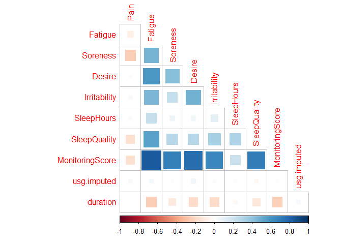
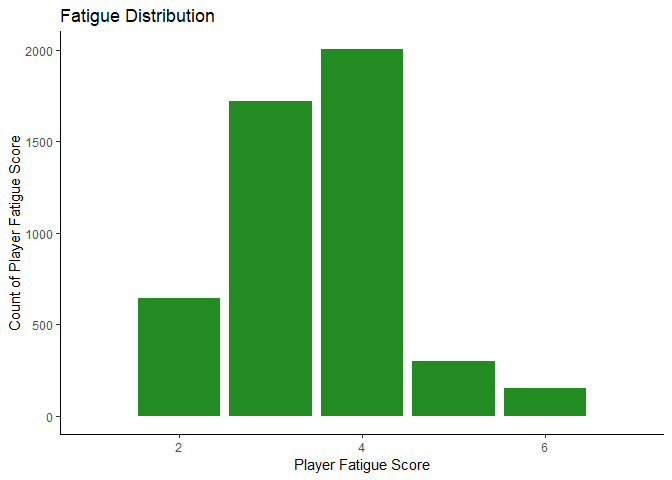
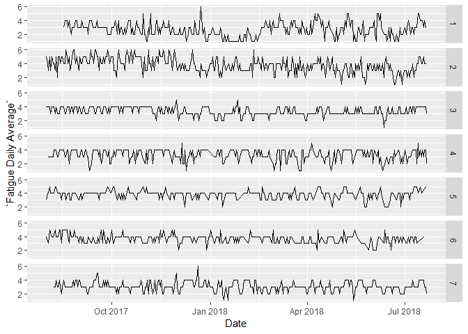

``` r
# useful functions 
mean.missing <- function(x) {
 return(mean(is.na(x)))
}

# round to 2 
round.numerics <- function(x, digits) {
 if (is.numeric(x)) {
  x <- round(x = x, digits = digits)
  }
 return(x)
}

# Average values remove NA 
avgcol <- function (x) {
 value = mean(x, na.rm = TRUE)
 return(value)
}

# count na 
countna <- function (x){
 value = length(is.na(x))
 return (value)
}

# replace missing with a stratisfied randomd sample 
replace.missing <- function(x){
    nn <- sum(is.na(x))
  if(nn>0){
     tab <- table(x)
     p <- tab / sum(tab)
     x[which(is.na(x))] = sample(names(tab), replace=T, size = nn, prob = p)
  }
    else{ x = x }
  return(x)
}

sampled.imputation <- function(x){ 
 w <- which(is.na(x)) 
 if(length(w) > 0){
  x[w] <- sample(x = x[!is.na(x)], size = length(w), replace = TRUE)}
 return(x) 
}
```

``` r
# file names 
games.file <- 'games.csv'
gps.file <- 'gps.csv'
rps.file <- 'rpe.csv'
wellness.file <- 'wellness.csv'

# import file 
games.data <- fread(games.file)
gps.data <- fread(gps.file)
rps.data <- fread(rps.file)
wellness.data <- fread(wellness.file)
```

``` r
# filter for the minumum game 
games.number <- 6
games.6.date <- games.data[GameID == 6]$Date
```

``` 
   GameID       Date Tournament TournamentGame   Team  Opponent Outcome
1:      1 2017-11-30      Dubai              1 Canada     Spain       W
2:      2 2017-11-30      Dubai              2 Canada   Ireland       W
3:      3 2017-11-30      Dubai              3 Canada      Fiji       W
4:      4 2017-12-01      Dubai              4 Canada    France       W
5:      5 2017-12-01      Dubai              5 Canada Australia       L
6:      6 2017-12-01      Dubai              6 Canada    Russia       L
   TeamPoints TeamPointsAllowed
1:         19                 0
2:         31                 0
3:         31                14
4:         24                19
5:          7                25
6:          5                10
```

``` 
   GameID Half PlayerID FrameID     Time GameClock     Speed AccelImpulse
1:      1    1        2       1 00:22:01  00:00:00 0.6583339    0.6111116
2:      1    1        2       2 00:22:01  00:00:00 0.5944449    0.6388894
3:      1    1        2       3 00:22:01  00:00:00 0.3638892    2.3055574
4:      1    1        2       4 00:22:01  00:00:00 0.4444448    0.8055562
5:      1    1        2       5 00:22:01  00:00:00 0.4000003    0.4444448
6:      1    1        2       6 00:22:01  00:00:00 0.0000000    4.0000032
     AccelLoad   AccelX  AccelY  AccelZ Longitude Latitude
1: 0.005330056  0.13250 0.69875 0.56500  55.46667 24.99487
2: 0.006568117  0.11125 0.92000 0.70625  55.46667 24.99487
3: 0.003114314  0.01375 0.77000 0.67750  55.46667 24.99487
4: 0.002601818  0.00625 0.88625 0.59500  55.46667 24.99487
5: 0.003813139 -0.01750 0.85750 0.57375  55.46667 24.99487
6: 0.003035785 -0.06375 0.90375 0.55125  55.46667 24.99487
```

``` 
         Date PlayerID Training       SessionType Duration RPE SessionLoad
1: 2018-07-21       13      Yes Mobility/Recovery        5   0           0
2: 2018-07-21       13      Yes              Game       29   7         203
3: 2018-07-21       13      Yes              Game       27   9         243
4: 2018-07-20       11      Yes              Game       36   6         216
5: 2018-07-20       11      Yes              Game       36   8         288
6: 2018-07-20       11      Yes Mobility/Recovery       15   2          30
   DailyLoad AcuteLoad ChronicLoad AcuteChronicRatio ObjectiveRating
1:       446     323.1      303.25              1.07              NA
2:        NA        NA          NA                NA              NA
3:        NA        NA          NA                NA              NA
4:       534     256.3      344.18              0.74               9
5:        NA        NA          NA                NA               9
6:        NA        NA          NA                NA               9
   FocusRating BestOutOfMyself
1:          NA      Not at all
2:          NA      Not at all
3:          NA      Not at all
4:          10      Absolutely
5:          10      Absolutely
6:          10      Absolutely
```

``` 
         Date PlayerID Fatigue Soreness Desire Irritability  BedTime
1: 2018-07-21        1       3        3      2            3 23:00:00
2: 2018-07-21        2       4        3      4            4 23:00:00
3: 2018-07-21        3       3        3      5            4 22:30:00
4: 2018-07-21        4       2        3      5            4 00:30:00
5: 2018-07-21        5       5        3      4            4 23:45:00
6: 2018-07-21        7       2        2      5            4 22:00:00
   WakeTime SleepHours SleepQuality MonitoringScore Pain Illness
1: 07:00:00       8.00            2              13   No      No
2: 07:00:00       8.00            4              19  Yes      No
3: 06:30:00       8.00            4              19   No      No
4: 07:00:00       6.50            1              15   No      No
5: 07:00:00       7.25            4              20   No      No
6: 07:00:00       9.00            3              16   No      No
   Menstruation Nutrition NutritionAdjustment USGMeasurement   USG
1:          Yes Excellent                 Yes             No    NA
2:          Yes      <NA>                <NA>            Yes 1.010
3:           No      <NA>                <NA>            Yes 1.016
4:          Yes Excellent                 Yes            Yes 1.025
5:           No      Okay                 Yes            Yes 1.022
6:           No Excellent                 Yes            Yes 1.014
   TrainingReadiness
1:                0%
2:                0%
3:              100%
4:               95%
5:              100%
6:               95%
```

    [1] 38  9

    [1] 4570160      14

    [1] 8860   14

    [1] 5011   19

# Exploring Missing Values

``` r
# Percentage of wellness missing 
wellness.na <- wellness.data[, lapply(X = .SD, FUN = 'mean.missing'), by = PlayerID]
wellness.na[ ,lapply(X = .SD, FUN = "round.numerics", digits = 2)]
```

``` 
    PlayerID Date Fatigue Soreness Desire Irritability BedTime WakeTime
 1:        1    0       0        0      0            0       0        0
 2:        2    0       0        0      0            0       0        0
 3:        3    0       0        0      0            0       0        0
 4:        4    0       0        0      0            0       0        0
 5:        5    0       0        0      0            0       0        0
 6:        7    0       0        0      0            0       0        0
 7:       10    0       0        0      0            0       0        0
 8:       11    0       0        0      0            0       0        0
 9:       13    0       0        0      0            0       0        0
10:       14    0       0        0      0            0       0        0
11:       15    0       0        0      0            0       0        0
12:       16    0       0        0      0            0       0        0
13:        6    0       0        0      0            0       0        0
14:       17    0       0        0      0            0       0        0
15:        8    0       0        0      0            0       0        0
16:       12    0       0        0      0            0       0        0
17:        9    0       0        0      0            0       0        0
    SleepHours SleepQuality MonitoringScore Pain Illness Menstruation
 1:          0            0               0    0       0         0.00
 2:          0            0               0    0       0         0.01
 3:          0            0               0    0       0         0.01
 4:          0            0               0    0       0         0.00
 5:          0            0               0    0       0         0.00
 6:          0            0               0    0       0         0.01
 7:          0            0               0    0       0         0.01
 8:          0            0               0    0       0         0.00
 9:          0            0               0    0       0         0.00
10:          0            0               0    0       0         0.00
11:          0            0               0    0       0         0.00
12:          0            0               0    0       0         0.00
13:          0            0               0    0       0         0.00
14:          0            0               0    0       0         0.00
15:          0            0               0    0       0         0.01
16:          0            0               0    0       0         0.00
17:          0            0               0    0       0         0.00
    Nutrition NutritionAdjustment USGMeasurement  USG TrainingReadiness
 1:      0.18                0.18           0.13 0.91                 0
 2:      0.83                0.81           0.01 0.84                 0
 3:      0.06                0.06           0.03 0.88                 0
 4:      0.17                0.02           0.00 0.83                 0
 5:      0.09                0.02           0.01 0.92                 0
 6:      0.00                0.00           0.00 0.85                 0
 7:      0.00                0.00           0.00 0.87                 0
 8:      0.00                0.00           0.00 0.86                 0
 9:      0.00                0.00           0.00 0.85                 0
10:      0.28                0.28           0.02 0.86                 0
11:      0.02                0.04           0.31 0.88                 0
12:      0.00                0.00           0.01 0.90                 0
13:      0.27                0.27           0.01 0.94                 0
14:      0.31                0.31           0.00 0.91                 0
15:      0.59                0.49           0.11 0.87                 0
16:      0.00                0.00           0.00 0.83                 0
17:      0.00                0.01           0.01 0.89                 0
```

``` r
# Count of Nutrition per player 
Nutrition.perplayer <- wellness.data[, .N, by = .(Nutrition, PlayerID)]
dcast(data = Nutrition.perplayer, PlayerID ~ Nutrition)
```

``` 
    PlayerID Excellent Okay Poor  NA
 1:        1       257    3    1  56
 2:        2        35   23    1 280
 3:        3       328   NA   NA  20
 4:        4       253    5   NA  51
 5:        5         6  220    9  24
 6:        6       150   40    1  72
 7:        7       305   37   NA   1
 8:        8        62   49   14 182
 9:        9       108  111    2  NA
10:       10       169  163   NA   1
11:       11       257   91   NA  NA
12:       12        15  214    1  NA
13:       13       309   41    1   1
14:       14       183    9   NA  73
15:       15       122   75    2   5
16:       16       145  171   28  NA
17:       17         9  146    3  71
```

``` r
# Count of Nutrition adjustment per player 
Nutrition.adj.perplayer <- wellness.data[, .N, by = .(NutritionAdjustment, PlayerID)]
Nutrition.adj.perplayer <- dcast(data = Nutrition.adj.perplayer, PlayerID ~ NutritionAdjustment)
Nutrition.adj.perplayer
```

``` 
    PlayerID I Don't Know  No Yes  NA
 1:        1           NA   3 257  57
 2:        2           NA  18  45 276
 3:        3           NA  NA 328  20
 4:        4            2   2 299   6
 5:        5           NA  10 243   6
 6:        6            1   6 184  72
 7:        7           NA   8 335  NA
 8:        8           11   5 142 149
 9:        9           NA   7 211   3
10:       10            7  67 258   1
11:       11           14   2 332  NA
12:       12            4 199  26   1
13:       13            2   9 341  NA
14:       14            1   1 190  73
15:       15            7  35 153   9
16:       16           41  48 255  NA
17:       17           10  19 128  72
```

``` r
# impute missing values in Nutrition, Nutrition USG adjustment 
wellness.data[, Nutrition.imputed := sampled.imputation(x = get("Nutrition"))]
wellness.data[, NutritionAdjustment.imputed := sampled.imputation(x = get("NutritionAdjustment"))]
wellness.data[, usg.imputed := sampled.imputation(x = get("USG"))]

# conver to numeric 
wellness.data$usg.imputed <- as.numeric(wellness.data$usg.imputed)

# Percentage of wellness missing 
wellness.na <- wellness.data[, lapply(X = .SD, FUN = 'mean.missing'), by = PlayerID]
wellness.na[ ,lapply(X = .SD, FUN = "round.numerics", digits = 2)]
```

``` 
    PlayerID Date Fatigue Soreness Desire Irritability BedTime WakeTime
 1:        1    0       0        0      0            0       0        0
 2:        2    0       0        0      0            0       0        0
 3:        3    0       0        0      0            0       0        0
 4:        4    0       0        0      0            0       0        0
 5:        5    0       0        0      0            0       0        0
 6:        7    0       0        0      0            0       0        0
 7:       10    0       0        0      0            0       0        0
 8:       11    0       0        0      0            0       0        0
 9:       13    0       0        0      0            0       0        0
10:       14    0       0        0      0            0       0        0
11:       15    0       0        0      0            0       0        0
12:       16    0       0        0      0            0       0        0
13:        6    0       0        0      0            0       0        0
14:       17    0       0        0      0            0       0        0
15:        8    0       0        0      0            0       0        0
16:       12    0       0        0      0            0       0        0
17:        9    0       0        0      0            0       0        0
    SleepHours SleepQuality MonitoringScore Pain Illness Menstruation
 1:          0            0               0    0       0         0.00
 2:          0            0               0    0       0         0.01
 3:          0            0               0    0       0         0.01
 4:          0            0               0    0       0         0.00
 5:          0            0               0    0       0         0.00
 6:          0            0               0    0       0         0.01
 7:          0            0               0    0       0         0.01
 8:          0            0               0    0       0         0.00
 9:          0            0               0    0       0         0.00
10:          0            0               0    0       0         0.00
11:          0            0               0    0       0         0.00
12:          0            0               0    0       0         0.00
13:          0            0               0    0       0         0.00
14:          0            0               0    0       0         0.00
15:          0            0               0    0       0         0.01
16:          0            0               0    0       0         0.00
17:          0            0               0    0       0         0.00
    Nutrition NutritionAdjustment USGMeasurement  USG TrainingReadiness
 1:      0.18                0.18           0.13 0.91                 0
 2:      0.83                0.81           0.01 0.84                 0
 3:      0.06                0.06           0.03 0.88                 0
 4:      0.17                0.02           0.00 0.83                 0
 5:      0.09                0.02           0.01 0.92                 0
 6:      0.00                0.00           0.00 0.85                 0
 7:      0.00                0.00           0.00 0.87                 0
 8:      0.00                0.00           0.00 0.86                 0
 9:      0.00                0.00           0.00 0.85                 0
10:      0.28                0.28           0.02 0.86                 0
11:      0.02                0.04           0.31 0.88                 0
12:      0.00                0.00           0.01 0.90                 0
13:      0.27                0.27           0.01 0.94                 0
14:      0.31                0.31           0.00 0.91                 0
15:      0.59                0.49           0.11 0.87                 0
16:      0.00                0.00           0.00 0.83                 0
17:      0.00                0.01           0.01 0.89                 0
    Nutrition.imputed NutritionAdjustment.imputed usg.imputed
 1:                 0                           0           0
 2:                 0                           0           0
 3:                 0                           0           0
 4:                 0                           0           0
 5:                 0                           0           0
 6:                 0                           0           0
 7:                 0                           0           0
 8:                 0                           0           0
 9:                 0                           0           0
10:                 0                           0           0
11:                 0                           0           0
12:                 0                           0           0
13:                 0                           0           0
14:                 0                           0           0
15:                 0                           0           0
16:                 0                           0           0
17:                 0                           0           0
```

``` r
# session type per employee 
rps.data.condition <- rps.data[Date == games.6.date,.N, by = .(SessionType, PlayerID)]
rps.data.condition <- dcast(data = rps.data.condition, SessionType ~ PlayerID)
rps.data.condition
```

``` 
         SessionType  1  3  5  6  7  8  9 10 11 12 13 15 16 17
1:      Conditioning  1 NA  1 NA NA NA NA NA NA NA NA  1  1 NA
2:              Game NA  2 NA NA  3  3  3  3  3  3  3 NA NA  3
3: Mobility/Recovery NA NA NA NA NA NA NA  1  1 NA  1 NA  1 NA
4:            Skills NA NA NA  2 NA NA  1 NA NA NA  1  1  1 NA
5:             Speed NA NA NA NA NA NA NA NA NA NA NA  1  1 NA
6:          Strength  1 NA  1 NA NA NA NA NA NA NA NA  1  1 NA
```

``` r
# Value per employees and session 
rps.data.replace <- rps.data[, lapply(.SD, avgcol), by = .(Date, PlayerID), .SDcols = 7:10]
rps.data.replace
```

``` 
            Date PlayerID SessionLoad DailyLoad AcuteLoad ChronicLoad
   1: 2018-07-21       13    148.6667       446     323.1      303.25
   2: 2018-07-20       11    178.0000       534     256.3      344.18
   3: 2018-07-20       13    102.0000       306     259.4      287.32
   4: 2018-07-19        1    180.0000       180      87.9      140.54
   5: 2018-07-19        2    240.0000       240     117.1      279.96
  ---                                                                
4327: 2017-08-01       10    320.0000       640      91.4       22.86
4328: 2017-08-01       11    250.0000       500      71.4       17.86
4329: 2017-08-01       12    140.0000       280      40.0       10.00
4330: 2017-08-01       13    420.0000       840     120.0       30.00
4331: 2017-08-01       15    150.0000       300      42.9       10.71
```

``` r
# extract the complete cases 
row.dt.replace <- nrow(rps.data.replace)
rps.data.replace <- rps.data.replace[complete.cases(rps.data.replace)]


paste0('Removed ', row.dt.replace - nrow(rps.data.replace), ' values from the dataset or ', 
       round(((row.dt.replace - nrow(rps.data.replace)) / row.dt.replace) * 100,2),  
       '%', 
       'total remaining is ', nrow(rps.data.replace))
```

    [1] "Removed 1206 values from the dataset or 27.85%total remaining is 3125"

# Data Exploration

``` r
# Game count 
game.count <- gps.data[,.(count = .N), by = GameID]

ggplot(data = game.count, aes(x = GameID, y = count)) + 
 geom_bar(stat = 'identity', fill = 'forestgreen') + 
 ggtitle('Number of Data points per game') + ylab('Count of games') + xlab('Game number') + 
 theme_classic() 
```

<!-- -->

``` r
# percentage of missing data 
gps.data[, lapply(.SD, mean.missing)]
```

``` 
   GameID Half PlayerID FrameID Time GameClock Speed AccelImpulse
1:      0    0        0       0    0         0     0            0
   AccelLoad AccelX AccelY AccelZ Longitude Latitude
1:         0      0      0      0 0.3315514        0
```

``` r
# cols to evalue
colnumer <- c(7:12)

# gps data summary 
gps.data.summary <- gps.data[, lapply(.SD, avgcol), by = .(GameID,PlayerID), .SDcols = colnumer]
gps.data.summary <- gps.data.summary[, lapply(.SD, round.numerics, digits = 2)]
```

``` r
# Health exploration  
wellness.data.health <- wellness.data[,c(map(.SD, mean)), by = .(Date,Nutrition.imputed,Pain), .SDcols = c(3:6,9:11,22)]
wellness.data.health$Date <- lubridate::as_date(wellness.data.health$Date)

# Fatigue Trends 
ggplot(data = wellness.data.health, aes(x = Date, y = Fatigue)) + geom_point(col = 'forestgreen') + 
 geom_smooth( fill = 'violetred4') + ggtitle('Fatigue Trends Over Time For Nutirion with Pain') + 
 theme_classic(base_family = 'trebuchet', base_size = 18) + facet_grid(Nutrition.imputed ~Pain) +
 theme(axis.text=element_text(size=12),axis.title=element_text(size=16,face="bold"))
```

<!-- -->

``` r
# soreness trends 
ggplot(data = wellness.data.health, aes(x = Date, y = Soreness)) + 
 geom_point(col = 'forestgreen') + geom_smooth( fill = 'violetred4') + 
 ggtitle('soreness Trends Over Time Nutirion with Pain') + 
 theme_classic() + facet_grid(Pain ~ Nutrition.imputed)
```

<!-- -->

``` r
# Desire Trend 
ggplot(data = wellness.data.health, aes(x = Date, y = Desire)) + 
 geom_point(col = 'forestgreen') + geom_smooth( fill = 'violetred4') + 
 ggtitle('Desire Trends Over Time: Nutirion with Pain') + 
 theme_classic() + facet_grid(Pain ~ Nutrition.imputed)
```

<!-- -->

``` r
# Irratability trend 
ggplot(data = wellness.data.health, aes(x = Date, y = Irritability)) + 
 geom_point(col = 'forestgreen') + geom_smooth( fill = 'violetred4') + 
 ggtitle('Irratability Trends Over Time Nutirion with Pain') + 
 theme_classic() + facet_grid(Pain ~ Nutrition.imputed)
```

<!-- -->

``` r
# sleep quality trend 
ggplot(data = wellness.data.health, aes(x = Date, y = SleepHours)) + 
 geom_point(col = 'forestgreen') + geom_smooth( fill = 'violetred4') + 
 ggtitle('Sleep Quality Trends Over Time Nutirion with Pain') + 
 theme_classic() + facet_grid(Pain ~ Nutrition.imputed)
```

<!-- -->

``` r
# Montitoring trend 
ggplot(data = wellness.data.health, aes(x = Date, y = MonitoringScore)) + 
 geom_point(col = 'forestgreen') + geom_smooth( fill = 'violetred4') + 
 ggtitle('Montitoring Trends Over Time Nutirion with Pain') + 
 theme_classic() + facet_grid(Pain ~ Nutrition.imputed)
```

<!-- -->

``` r
# data transformation 
wellness.data.health$duration <- wellness.data.health$Date - min(wellness.data.health$Date)  
wellness.data.health$duration <- as.numeric(wellness.data.health$duration)
wellness.data.health$NutritionAdjustment.imputed <- as.numeric(unlist(as.data.frame(wellness.data.health$NutritionAdjustment.imputed)))
wellness.data.health$Pain <- as.numeric(unlist(as.data.frame(wellness.data.health$Pain)))
wellness.data.health$Nutrition.imputed <- as.numeric(wellness.data.health$Nutrition.imputed)

map_chr(wellness.data, class)
```

``` 
                       Date                    PlayerID 
                "character"                   "integer" 
                    Fatigue                    Soreness 
                  "integer"                   "integer" 
                     Desire                Irritability 
                  "integer"                   "integer" 
                    BedTime                    WakeTime 
                "character"                 "character" 
                 SleepHours                SleepQuality 
                  "numeric"                   "integer" 
            MonitoringScore                        Pain 
                  "integer"                 "character" 
                    Illness                Menstruation 
                "character"                 "character" 
                  Nutrition         NutritionAdjustment 
                "character"                 "character" 
             USGMeasurement                         USG 
                "character"                   "numeric" 
          TrainingReadiness           Nutrition.imputed 
                "character"                 "character" 
NutritionAdjustment.imputed                 usg.imputed 
                "character"                   "numeric" 
```

``` r
#replace NA with 3 
#wellness.data.health$Nutrition <- replace_na(data = wellness.data.health$Nutrition, replace = 3)

# correlation 
well.corr <- cor(wellness.data.health[,c(3:12)])

map_chr(wellness.data, class)
```

``` 
                       Date                    PlayerID 
                "character"                   "integer" 
                    Fatigue                    Soreness 
                  "integer"                   "integer" 
                     Desire                Irritability 
                  "integer"                   "integer" 
                    BedTime                    WakeTime 
                "character"                 "character" 
                 SleepHours                SleepQuality 
                  "numeric"                   "integer" 
            MonitoringScore                        Pain 
                  "integer"                 "character" 
                    Illness                Menstruation 
                "character"                 "character" 
                  Nutrition         NutritionAdjustment 
                "character"                 "character" 
             USGMeasurement                         USG 
                "character"                   "numeric" 
          TrainingReadiness           Nutrition.imputed 
                "character"                 "character" 
NutritionAdjustment.imputed                 usg.imputed 
                "character"                   "numeric" 
```

``` r
colnames(wellness.data)
```

``` 
 [1] "Date"                        "PlayerID"                   
 [3] "Fatigue"                     "Soreness"                   
 [5] "Desire"                      "Irritability"               
 [7] "BedTime"                     "WakeTime"                   
 [9] "SleepHours"                  "SleepQuality"               
[11] "MonitoringScore"             "Pain"                       
[13] "Illness"                     "Menstruation"               
[15] "Nutrition"                   "NutritionAdjustment"        
[17] "USGMeasurement"              "USG"                        
[19] "TrainingReadiness"           "Nutrition.imputed"          
[21] "NutritionAdjustment.imputed" "usg.imputed"                
```

``` r
corrplot(corr = well.corr, method = 'square', type = 'lower', diag = FALSE, is.corr = TRUE)
```

<!-- -->

``` r
# fatigue 
ggplot(data = wellness.data, aes( x = Fatigue)) + geom_bar( fill = 'forestgreen') + 
 ggtitle('Fatigue Distribution') + xlab('Player Fatigue Score')  + ylab('Count of Player Fatigue Score') + 
 xlim(1,7) + 
 theme_classic()
```

<!-- -->

``` r
map_chr(wellness.data.health, class)
```

``` 
                       Date           Nutrition.imputed 
                     "Date"                   "numeric" 
                       Pain                     Fatigue 
                  "numeric"                   "numeric" 
                   Soreness                      Desire 
                  "numeric"                   "numeric" 
               Irritability                  SleepHours 
                  "numeric"                   "numeric" 
               SleepQuality             MonitoringScore 
                  "numeric"                   "numeric" 
                usg.imputed                    duration 
                  "numeric"                   "numeric" 
NutritionAdjustment.imputed 
                  "numeric" 
```

``` r
dim(wellness.data.health)
```

    [1] 1206   13

``` r
names(wellness.data.health)
```

``` 
 [1] "Date"                        "Nutrition.imputed"          
 [3] "Pain"                        "Fatigue"                    
 [5] "Soreness"                    "Desire"                     
 [7] "Irritability"                "SleepHours"                 
 [9] "SleepQuality"                "MonitoringScore"            
[11] "usg.imputed"                 "duration"                   
[13] "NutritionAdjustment.imputed"
```

``` r
head(wellness.data.health)
```

``` 
         Date Nutrition.imputed Pain Fatigue Soreness   Desire
1: 2018-07-21                NA    1     3.0 2.777778 4.666667
2: 2018-07-21                NA    2     4.0 3.000000 4.000000
3: 2018-07-21                NA    1     4.0 2.500000 4.500000
4: 2018-07-20                NA    1     3.7 4.300000 5.200000
5: 2018-07-20                NA    2     4.0 4.000000 5.000000
6: 2018-07-20                NA    1     5.0 6.000000 6.000000
   Irritability SleepHours SleepQuality MonitoringScore usg.imputed
1:          4.0      8.000     3.444444        17.88889    1.017556
2:          4.0      8.000     4.000000        19.00000    1.010000
3:          3.5      7.625     3.000000        17.50000    1.081000
4:          4.2      8.475     3.900000        21.30000    1.030100
5:          4.0      9.000     3.000000        20.00000    1.017000
6:          5.0      7.250     5.000000        27.00000    1.022000
   duration NutritionAdjustment.imputed
1:      354                          NA
2:      354                          NA
3:      354                          NA
4:      353                          NA
5:      353                          NA
6:      353                          NA
```

``` r
fatigue.daily.average <- wellness.data[ PlayerID %in% c(1:7), .(`Fatigue Daily Average`  = mean(Fatigue), `Mean Monitoring Score` = mean(MonitoringScore)), by = .(Date, PlayerID)]
fatigue.daily.average$Date <- as.Date(fatigue.daily.average$Date)


ggplot(fatigue.daily.average) + geom_line(aes(x = Date , y = `Fatigue Daily Average`)) +
 facet_grid(PlayerID ~ . )
```

<!-- -->

``` r
wellness.data[Fatigue == 7]
```

``` 
         Date PlayerID Fatigue Soreness Desire Irritability  BedTime
1: 2018-06-17        8       7        4      7            7 22:00:00
2: 2018-04-27       15       7        4      4            5 19:00:00
3: 2018-02-06       15       7        6      6            5 22:15:00
4: 2018-02-05       15       7        7      7            7 21:00:00
5: 2018-01-25        9       7        6      4            4 20:30:00
6: 2017-08-28       15       7        7      7            7 22:15:00
7: 2017-08-08        9       7        7      7            7 21:00:00
   WakeTime SleepHours SleepQuality MonitoringScore Pain Illness
1: 07:30:00       9.50            7              32   No      No
2: 07:00:00      12.00            7              27   No      No
3: 08:00:00       9.75            6              30   No      No
4: 06:30:00       9.50            7              35   No      No
5: 07:00:00      10.50            4              25   No      No
6: 07:30:00       9.25            7              35   No      No
7: 08:30:00      11.50            7              35   No      No
   Menstruation Nutrition NutritionAdjustment USGMeasurement   USG
1:           No      <NA>                <NA>           <NA>    NA
2:           No Excellent                 Yes           <NA>    NA
3:           No Excellent                 Yes             No    NA
4:           No Excellent                <NA>             No    NA
5:           No      Okay                <NA>            Yes 1.015
6:           No Excellent                 Yes             No    NA
7:           No Excellent                 Yes             No    NA
   TrainingReadiness Nutrition.imputed NutritionAdjustment.imputed
1:                0%              Okay                         Yes
2:               95%         Excellent                         Yes
3:               90%         Excellent                         Yes
4:               95%         Excellent                         Yes
5:               65%              Okay                          No
6:              100%         Excellent                         Yes
7:              100%         Excellent                         Yes
   usg.imputed
1:       1.015
2:       1.006
3:       1.015
4:       1.013
5:       1.015
6:       1.018
7:       1.015
```

``` r
# count of number of records per day in the wellness data 
Wellness.data.count <- wellness.data %>%
 group_by(Date) %>%
 summarise(count = n())

# games and date 
gamesdate<- games.data[,1:2]

# games data 
gps.data.summary <- merge(x = gps.data.summary, y = gamesdate, by = 'GameID')

# Generate unique ID 
wellness.data$uniqueid <- paste0(wellness.data$Date, wellness.data$PlayerID)
gps.data.summary$uniqueid <- paste0(gps.data.summary$Date, gps.data.summary$PlayerID)
```

``` r
merged.data <- right_join(x = gps.data.summary, y = wellness.data,by = 'uniqueid')
```
